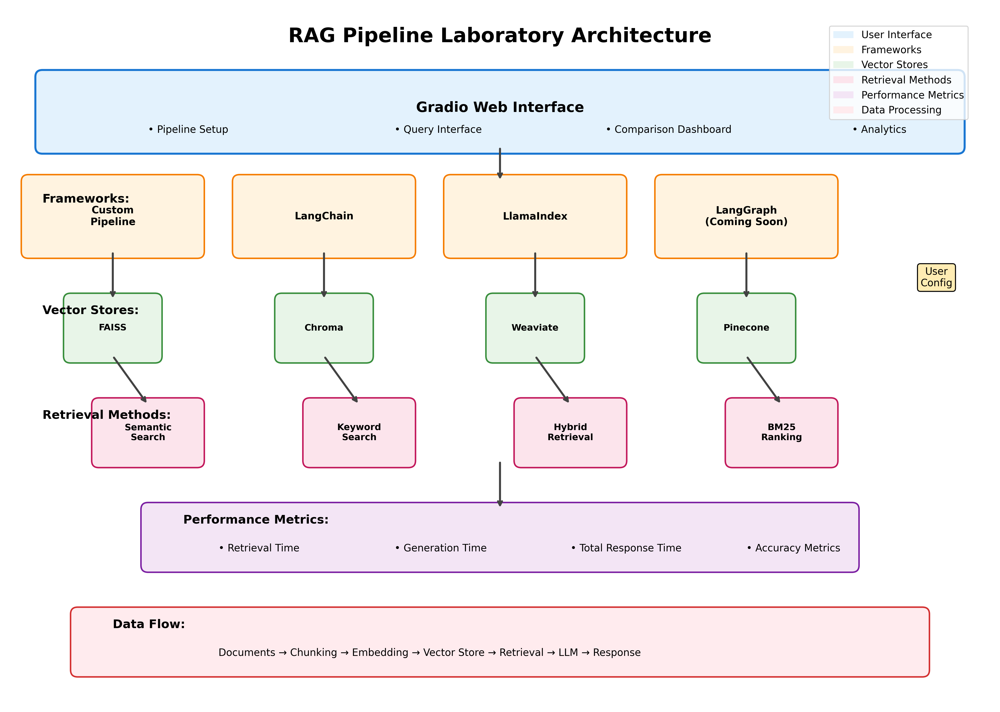

# 🔬 RAG Pipeline Laboratory

A comprehensive platform for experimenting with different Retrieval-Augmented Generation (RAG) configurations and comparing their performance. This project provides a modular framework supporting multiple frameworks, vector stores, and retrieval methods with an interactive Gradio interface.



## ✨ Features

- **Multiple Framework Support**: LangChain, LlamaIndex, LangGraph, and Custom implementations
- **Vector Store Options**: FAISS, Chroma, Weaviate, Pinecone
- **Retrieval Methods**: Semantic search, keyword search, hybrid, BM25
- **Interactive Web Interface**: Built with Gradio for easy experimentation
- **Performance Comparison**: Side-by-side comparison of different configurations
- **Real-time Metrics**: Track retrieval time, generation time, and accuracy
- **Modular Architecture**: Easy to extend with new components

## 🚀 Quick Start

1. **Install Dependencies**:
```bash
pip install -r requirements.txt
```

2. **Set up Environment Variables**:
```bash
cp .env.example .env
# Edit .env with your API keys
```

3. **Run the Application**:
```bash
python app.py
```

4. **Open in Browser**: The Gradio interface will automatically open at `http://localhost:7860`

## 📁 Project Structure

```
Rag-Pipelines-Laboratory/
├── app.py              # Main Gradio application
├── rag_pipeline.py     # Core RAG pipeline implementations
├── config.py           # Configuration classes and enums
├── requirements.txt    # Python dependencies
├── .env.example       # Environment variables template
├── .gitignore         # Git ignore patterns
└── README.md          # This file
```

## 🛠️ Usage

### Pipeline Setup
1. Choose your preferred framework (LangChain, LlamaIndex, Custom)
2. Select a vector store (FAISS, Chroma, etc.)
3. Pick a retrieval method (semantic, keyword, hybrid)
4. Configure embedding model and LLM
5. Adjust parameters (chunk size, top-k, temperature)

### Querying
- Enter your question in the query interface
- View the generated answer along with retrieved documents
- Monitor performance metrics in real-time

### Comparison
- Test multiple configurations side-by-side
- Compare performance metrics across different setups
- Analyze trade-offs between speed and accuracy

## 🔧 Configuration Options

### Frameworks
- **Custom**: Lightweight implementation with direct control
- **LangChain**: Popular framework with extensive ecosystem
- **LlamaIndex**: Optimized for data-centric applications
- **LangGraph**: (Coming soon) Graph-based approach

### Vector Stores
- **FAISS**: Fast similarity search, good for prototyping
- **Chroma**: Open-source with good Python integration
- **Weaviate**: Production-ready with advanced features
- **Pinecone**: Managed service with excellent performance

### Retrieval Methods
- **Semantic**: Vector similarity search
- **Keyword**: Traditional text matching
- **Hybrid**: Combines semantic and keyword approaches
- **BM25**: Statistical ranking function

## 📊 Performance Metrics

The application tracks:
- **Retrieval Time**: Time to find relevant documents
- **Generation Time**: Time to generate the final answer
- **Total Time**: End-to-end response time
- **Document Quality**: Relevance of retrieved documents

## 🔑 Environment Variables

Create a `.env` file with the following variables:

```bash
OPENAI_API_KEY=your_openai_api_key
PINECONE_API_KEY=your_pinecone_api_key (optional)
PINECONE_ENVIRONMENT=your_pinecone_environment (optional)
WEAVIATE_URL=your_weaviate_url (optional)
WEAVIATE_API_KEY=your_weaviate_api_key (optional)
```

## 🤝 Contributing

Contributions are welcome! Areas for improvement:
- Additional framework integrations
- New retrieval algorithms
- Enhanced evaluation metrics
- UI/UX improvements

## 📝 License

MIT License - see LICENSE file for details
